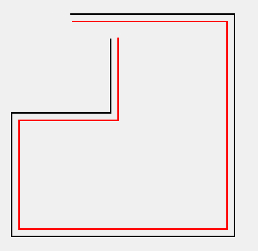
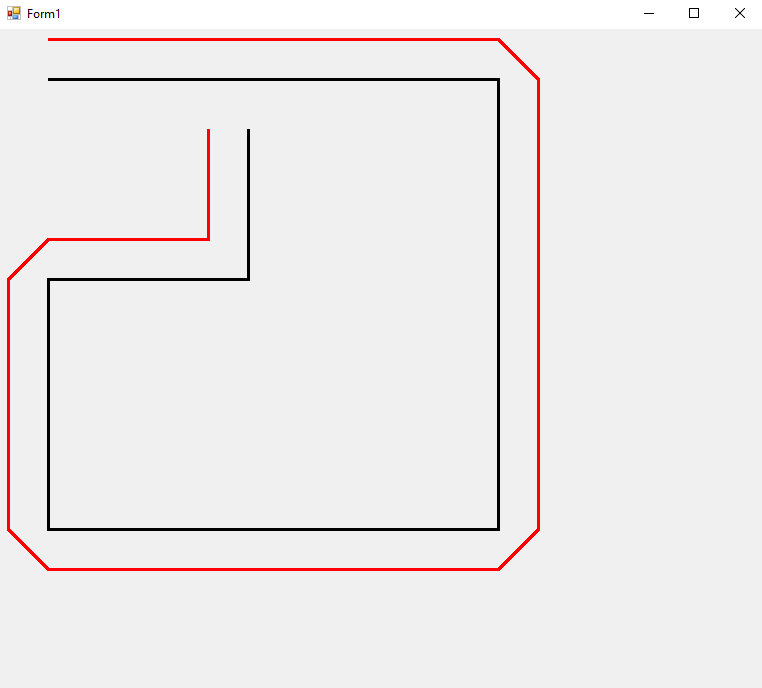

<!-- ABOUT THE PROJECT -->
## About The Project
This project will help you to get parallel line of a given line. To solve it, I've gather few code which was written 
in python from StakeOverFlow (https://stackoverflow.com/questions/65654982/offset-a-line-vector-parallel-to-given-lines)
and Converted into C#.

## Implementation (Call From Main Function)
            List<PointF> line1 = new List<PointF>
            {
                new PointF(50,50),
                new PointF(500,50),
                new PointF(500, 500),
                new PointF(50, 500),
                new PointF(50, 250),
                new PointF(250, 250),
                new PointF(250, 100)
            };
            
            List<double> oldX = new List<double>();
            List<double> oldY = new List<double>();
            for (int i = 0; i < line1.Count; i++)
            {
                oldX.Add(line1[i].X);
                oldY.Add(line1[i].Y);
            }
            double offset = 15;
            ParallelPointClass.getEnlarged(oldX, oldY, offset);
            var newX = ParallelPointClass.newX;
            var newY = ParallelPointClass.newY;
            List<PointF> line2 = new List<PointF>();
            for (int i = 0; i < newX.Count; i++)
            {
                line2.Add(new PointF((float)newX[i], (float)newY[i]));
            }

            [Note: You need only ParallelPointClass Class. Rest of class you need not to use. Those are used to create face in OBJ file. You can go through if you interested]

## Technique 1

## Technique 2

